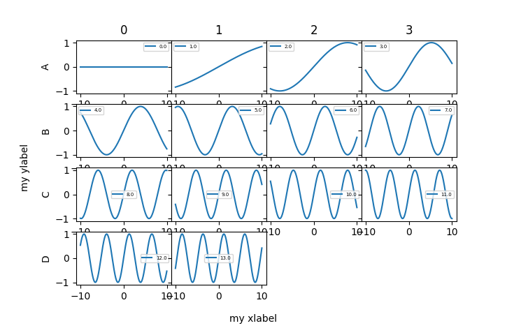

.. _get-started-label:

Get started
===========

Use cases.

Load data
---------

.. code:: python
   
   # Read *.ods or excel (spreadsheet).
   data = pd.read_excel('D:\...\data2.ods', sheet_name=0,
                        skiprows=1).dropna(how='all')
   data.name = 'data2'

Experiment subpackage
---------------------

You can either use subpackages directly (``physicslab.experiment.van_der_pauw``)
or utilize the following batch function.

.. code:: python

   # Example: Van der Pauw
   import pandas as pd

   def load(filename):
      measurement = pd.read_csv(filename + '.csv')
      measurement.name = filename
      return measurement
   
   thickness = 1.262e-6  # meters
   samples = ['sample#1', 'sample#2', ...]
   measurements = [load(sample) for sample in samples]
   
   results = physicslab.experiment.process(
      measurements,
      by_module=physicslab.experiment.van_der_pauw,
      thickness=thickness
   )
   print(results)
 
.. code:: bash
 
              sheet_resistance  ratio_resistance  sheet_conductance  resistivity  conductivity
   sample#1       1.590823e+05          1.168956       6.286055e-06     0.200762      4.981026
   sample#2       1.583278e+05          1.185031       6.316009e-06     0.199810      5.004762
   ...

Van der Pauw
------------

Handling Geometry enum.

.. code:: python

   def get_geometry(orientation, direct):
      """ 
      :param int orientation: Contacts rotation in multiples of 90°.
      :param bool direct: Contacts counter-clockwise (True) or not.
      """
      geometry = van_der_pauw.Geometry.R1234  # Default configuration.
      geometry = geometry.shift(number=orientation)
      if not direct:
         geometry = geometry.reverse_polarity()
      return geometry

Magnetism type
--------------

.. code:: python

   results = physicslab.experiment.magnetism_type.process(measurement)
   print(results)

   col = physicslab.experiment.magnetism_type.Measurement.Columns
   B = measurement[col.MAGNETICFIELD]
   plt.plot(B, measurement[col.MAGNETIZATION], 'ko')  # Original data.
   plt.plot(B, measurement[col.DIAMAGNETISM], 'r-')  # Separated DIA contribution.
   plt.plot(B, measurement[col.FERROMAGNETISM], 'b-')  # Separated FM contribution.
   plt.plot(B, measurement[col.RESIDUAL_MAGNETIZATION], 'g-')  # Residual (unseparated) data.
   plt.show()

curves.Line
-----------

.. code:: python

   line1 = Line(3, -2)  # Line: y = 3 - 2x
   line2 = Line(slope=2)  # Line: y = 0 + 2x
   line1(4.3)  # -5.6
   line1 - 5.3 + 2.4 * line2  # Line: y = -2.3 + 2.8x
   line1.zero()  # 1.5
   Line.Intersection(line1, line2)  # (0.75, 1.5)

ui.plot_grid & utility.squarificate
-----------------------------------

.. code:: python

   import matplotlib.pyplot as plt
   import numpy as np
   import physicslab

   x = np.linspace(-10, 10, num=1000)

   def plot_value(ax, value):  # Sine.
      ax.plot(x, np.sin(x * value / 10), label=value)

   def alphabet(num):  # ['A', 'B', ...]
      return [(chr(ord('A') + i)) for i in range(num)]

   data = np.arange(14, dtype=float)  # E.g. a list of measurements.
   data = physicslab.utility.squarificate(data)  # Squarish 2D array distribution.
   df = pd.DataFrame(data, index=alphabet(data.shape[0]))  # Naming.
   df.name = 'My title'

   print(df)
   physicslab.ui.plot_grid(
      df, plot_value, xlabel='my xlabel', ylabel='my ylabel',
      subplots_adjust_kw={'hspace': 0}, sharey=True, legend_size=5)

.. code:: bash

         0     1     2     3
   A   0.0   1.0   2.0   3.0
   B   4.0   5.0   6.0   7.0
   C   8.0   9.0  10.0  11.0
   D  12.0  13.0   NaN   NaN

ui.plot_grid
------------
.. code:: python

   import matplotlib.image as mpimg
   
   # Show pictures (like SEM images). Parameter value is then e.g. a filename.
   def plot_value(ax, value):
      img = mpimg.imread(filepath)
      ax.imshow(img, cmap='gray')
